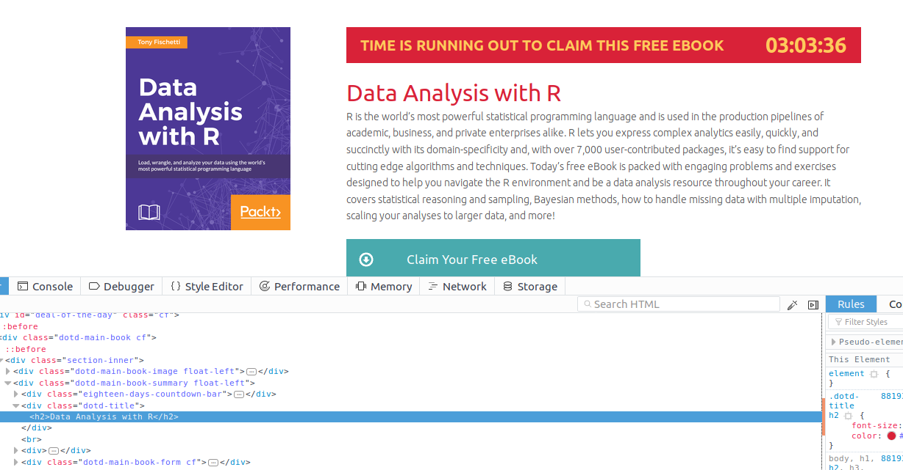

Often I come across some websites that have free e-book deals each day or once in a while. Sometimes I'm lucky and it's currently some title or topic I am interested in, but usually it's some topic I have absolutely no clue about ("Learning Linux Binary Analysis").  
However, you never know! Tomorrow or maybe in 18 days time there might be something on exactly the topic you are curious about!

Usually (at least for me) these websites end up in some dark corner in the bookmarks - maybe I would go back and check the deal for a couple of days in a row, but then I would slowly forget about it and every now and then remember to check back in on some free learning materials.  
So I thought to piece together a small scraper that would get the book deal of the day and push a desktop notification when i log in. That way I could stay informed and never miss the chance to obtain some nice material on a topic of interest.  

# Packt Learning Website

[Packt](https://www.packtpub.com/) is a website that offers learning materials on all kinds of IT related things - from general programming language textbooks to highly specialised titles. Each day there is a different book offered as a book-of-the-day deal for [free](https://www.packtpub.com/packt/offers/free-learning)!  
In order to get the book one just needs to head over to their website and make a free account which entitles then the free download (availabe in a couple of different formats as well). I have used this opportuntity to get my hands on some books about 3D Printing, Git essentials as well as the obligatory Javascript data structures and algorithms :--).  

Alright time to get the tools out... 

```{r setup, warning=FALSE, message=FALSE}

# httr & rvest scraping tools
library("tidyverse")
# for reading and writing images 
library("magick")
# for pushing a notification to the desktop
library("notifier")

# packt url for free learning deal of the day
packt <- "https://www.packtpub.com/packt/offers/free-learning"
```

## Scraping the book deal  

Inspecting the html of the page we notice that we are interested in the "`dotd-title`" and the "`dotd-main-book-image float-left`" `div`'s.   
  

We'll pull out the book title and the cover image.

```{r read_site}
# Scrape book deal of the day -----
getwd()
# read in html
parse_site <-
  packt %>%
  httr::GET() %>%
  httr::content()

# extract the title of the deal of
# the day and remove any extra
# spacing and indentation around it
book_deal <-
  parse_site %>%
  rvest::html_nodes(".dotd-title") %>%
  rvest::html_text() %>%
  stringr::str_replace_all("\\n*\\t*", "")

# scrape the image for the book

# read in the img string
img_link <-
  parse_site %>%
  rvest::html_nodes(".dotd-main-book-image") %>%
  rvest::html_node("img") %>%
  rvest::html_attr("src") %>%
  stringr::str_replace_all(" ", "%20")

```


## Push notification to desktop

Gabor Csardi's notifer package or alternatively using toast on win or notify-send on linux. Note that notifier is currently broken so resort to version 1.0.0 


## Schedule script on logon 

Useful packages taskscheduleR and cron - however on win there is LOGON opt but cron on linux offers only datetime triggers (or i couldn't figure it out). therefore scheduled it as a bash script.

## Future todos

- For the analysis part need to find a way how to automatically detect the keyword that stands for a certain language/technology from the book title. I'm sure there is somewhere out there a nice list of all possible languages and technologies under the sun that could be matched against.  

- A possible adaptation for the purpose of this scraper would be to just store some keywords that one is interested in like e.g. "machine learning", "data structures c" and fuzzy-match against it in order to signal an offer tailored to one's interests.